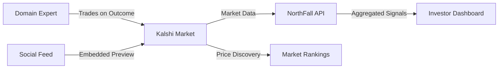

<div align="center">
  <h1>🎯 NorthFall</h1>
  <p><strong>Turn Expert Insight into Market-Driven Startup Discovery</strong></p>
  
  <p>
    <a href="https://northfall.vercel.app">Website</a> •
    <a href="#features">Features</a> •
    <a href="#how-it-works">How It Works</a> •
    <a href="#getting-started">Getting Started</a>
  </p>

  
</div>

---

## 🚀 Overview

**Operators know things before investors do** — but there's no incentive-compatible, scalable way to surface that knowledge.

NorthFall bridges the gap between expert insight and capital allocation through prediction markets powered by Kalshi's regulated infrastructure. We turn on-the-ground knowledge into actionable investment signals.

### The Problem

Investors struggle to identify promising startups early. Traditional sourcing methods are:

- **Expensive** — Manual scouting and fragmented research drain resources
- **Slow** — Personal networks and referrals create bottlenecks  
- **Incomplete** — The best signals often come from operators who lack direct channels to investors

Meanwhile, domain experts and operators possess valuable, real-time insight about emerging companies — but there's no efficient mechanism to connect that knowledge to capital or reward it properly.

This creates a fundamental **information asymmetry** between what people know and how capital gets allocated.

### The Solution

NorthFall transforms expert insight into a market built directly on **Kalshi's prediction market APIs**.

Instead of collecting static opinions or research reports, we enable people with real domain knowledge to **put economic weight behind their views** by trading in prediction markets tied to objective, time-bound startup outcomes.

Market prices and positions are programmatically aggregated via Kalshi's APIs into **clear, investor-ready rankings** that surface stronger opportunities earlier.

> **Our goal isn't to replace judgment or diligence** — it's to cut through noise, make high-quality insight visible, and ensure it's worth contributing.

---

## ✨ Features

### 🔍 Market Discovery
Browse prediction markets on early-stage startups with objective, verifiable outcomes. See where domain experts are placing their bets across sectors and stages.

### 📱 Social Trading
Trade directly from your social feed through **interactive link previews** inspired by Solana blinks. When you encounter a startup discussion on Twitter or elsewhere, participate in the market instantly — no context switching required.

### 📊 Signal Aggregation  
View real-time market data aggregated from Kalshi's APIs. Get investor-ready rankings that reflect the collective wisdom of operators, builders, and domain experts.

### 🏛️ Kalshi Integration
Built on Kalshi's **regulated prediction market infrastructure**. All market creation, trading, and settlement leverage Kalshi's compliant platform.

### ⚡ Real-Time Rankings
Programmatically pulled market positions create live signals that help investors identify high-potential opportunities as they emerge.

---

## 🔄 How It Works



### 1. **Market Creation**
Prediction markets are created for early-stage startups with objective outcomes:
- Funding milestones (e.g., "Will Company X raise a Series A by Q4 2026?")
- Revenue targets (e.g., "Will Company Y reach $1M ARR by EOY?")
- Product launches (e.g., "Will Company Z launch their beta by March?")

### 2. **Expert Participation**
Operators, builders, and domain insiders trade YES/NO positions based on their conviction and knowledge.

### 3. **Social Distribution**
Markets are embedded directly into social feeds via interactive link previews — capturing insight **where it happens**.

### 4. **Signal Aggregation**
Market prices and positions are pulled programmatically via Kalshi's APIs and transformed into actionable rankings for investors.

---

## 🎯 Why NorthFall?

| Traditional VC Sourcing | NorthFall Markets |
|------------------------|-------------------|
| Manual scouting | Automated signal aggregation |
| Personal networks | Open expert participation |
| Fragmented research | Real-time market data |
| Passive commentary | Economic skin in the game |
| Slow feedback loops | Instant price discovery |

---

## 🛠️ Tech Stack

- **Frontend**: Next.js 15 (Turbopack), React, TailwindCSS
- **3D Graphics**: Three.js
- **Animation**: Framer Motion
- **Markets**: Kalshi Prediction Market APIs
- **Deployment**: Vercel
- **Styling**: Netflix-inspired red theme (#E50914)

---

## 🚀 Getting Started

### Prerequisites
- Node.js 18+ 
- pnpm 8+

### Installation

```bash
# Clone the repository
git clone https://github.com/ayushshrivastv/NorthFall.git
cd NorthFall

# Install dependencies
pnpm install

# Set up environment variables
cp .env.example .env
# Edit .env with your configuration

# Run development server
pnpm dev
```

The application will be available at `http://localhost:3000`

### Build for Production

```bash
pnpm build
pnpm start
```

---

## 📂 Project Structure

```
northfall/
├── apps/
│   ├── web/              # Next.js frontend application
│   ├── server/           # Backend API services
│   └── socket/           # Real-time WebSocket server
├── packages/
│   ├── database/         # Prisma database schemas
│   └── typescript-config/ # Shared TypeScript configs
└── public/               # Static assets
```

---

## 🤝 Contributing

We welcome contributions! Please see our [Contributing Guidelines](CONTRIBUTING.md) for details.

1. Fork the repository
2. Create your feature branch (`git checkout -b feature/amazing-feature`)
3. Commit your changes (`git commit -m 'Add amazing feature'`)
4. Push to the branch (`git push origin feature/amazing-feature`)
5. Open a Pull Request

---

## 📄 License

This project is licensed under the MIT License - see the [LICENSE](LICENSE) file for details.

---

## 🔗 Links

- **Website**: [northfall.vercel.app](https://northfall.vercel.app)
- **Documentation**: [docs.northfall.dev](https://northfall.vercel.app/docs)
- **Twitter**: [@northfall](https://twitter.com/northfall)
- **LinkedIn**: [Ayush Srivastava](https://www.linkedin.com/in/ayushshrivastv/)

---

## 💡 Inspiration

NorthFall draws inspiration from:
- **Prediction markets** as information aggregation mechanisms
- **Solana blinks** for seamless social integration
- **Kalshi's** regulated market infrastructure
- The belief that **operators know things before investors do**

---

<div align="center">
  <p>Built with ❤️ by the NorthFall team</p>
  <p>Powered by <a href="https://kalshi.com">Kalshi</a> prediction markets</p>
</div>
