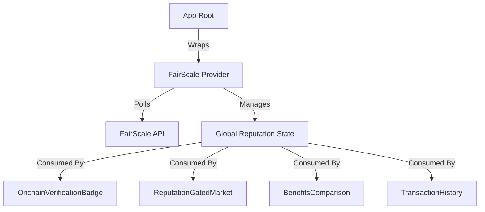

# FairScale Integration

This directory contains the integration of FairScale onchain reputation scoring into the NorthFall application. The implementation focuses on providing a verifiable, metric-driven approach to user trust that enables dynamic access control and incentivized participation without reliance on centralized identity providers.

## System Architecture

The FairScale integration operates as a self-contained feature module orchestrated by a central provider. This ensures a clean separation of concerns where reputation state is managed globally but consumed locally by specific components.

### Architecture Overview



### Core Data Flow

1.  **State Initialization**: The `FairScaleProvider` initializes at the application root, ensuring reputation data is available before page content renders.
2.  **API Communication**: The `fairscaleApi.ts` utility layer handles secure communication with the FairScale endpoints, managing retries and error states.
3.  **Context Distribution**: Reputation data (FairScore, Tier, History) is broadcast via React Context to any component using the `useFairScale` hook.
4.  **Access Control**: Logical hooks like `useTierAccess` consume this state to enforce market gating and benefit unlocking in real-time.

## Project Setup

To activate the FairScale integration features within the NorthFall application, ensure the following configuration is in place.

### Environment Configuration

Add the specific FairScale keys to your `.env.local` file to enable API connectivity and onchain verification links:

```bash
# FairScale API Access
NEXT_PUBLIC_FAIRSCALE_API_KEY=your_production_api_key
NEXT_PUBLIC_FAIRSCALE_API_URL=https://api.fairscale.xyz

# Solana Program Reference
NEXT_PUBLIC_FAIRSCALE_PROGRAM_ID=fairScaLe1111111111111111111111111111111111
```

### Dependency Structure

The feature is organized to be modular and easily maintainable:

-   **`providers/`**: Contains `FairScaleProvider.tsx` which serves as the single source of truth for reputation state.
-   **`components/`**: Modular UI elements including:
    -   `OnchainVerificationBadge`: Displays trust status with explorer links.
    -   `ReputationGatedMarket`: Handles conditional rendering for locked/unlocked markets.
    -   `TransactionHistory`: Visualizes reputation impact of past actions.
-   **`hooks/`**: Reusable logic such as `useTierAccess` for abstracting complex permission checks.
-   **`utils/`**: Type-safe API clients and data transformation helpers.

## Functional Capabilities

### Reputation Gating Architecture
Market access is governed by a hierarchical tier system that maps quantitative scores to qualitative access levels. The system provides explicit transparency, showing users exactly what score requirements are needed to unlock specific markets, rather than opaque "access denied" messages.

### Onchain Verification
To establish trust, the integration links off-chain scores to onchain data. The verification badge provides direct evidence via Solana Explorer links, allowing users to independently audit the legitimacy of their reputation score and the contract state.

### Dynamic Benefits System
The system transforms reputation from a fast vanity metric into an active economic utility. Higher tiers automatically unlock tangible system parameters such as:
-   **Fee Discounts**: Programmatic reduction in protocol fees.
-   **Trading Limits**: Expanded position size caps for trusted users.
-   **Reward Multipliers**: Enhanced yield farming rates for long-term participants.

### Transaction History & Transparency
The activity logging system creates a feedback loop for user behavior. By highlighting exactly which transactions contributed to reputational growth or decline, the system educates users on optimal protocol interaction patterns.
